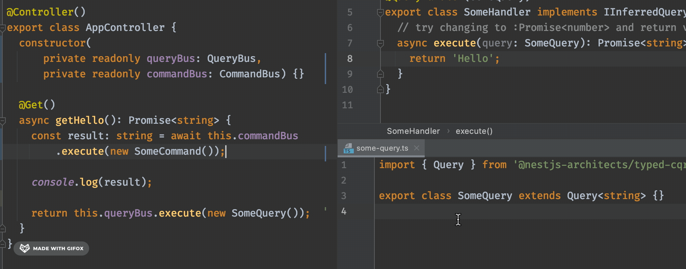

# nestjs-typed-cqrs

[](https://www.npmjs.com/package/@nestjs-architects/typed-cqrs)
[](https://www.npmjs.com/package/@nestjs-architects/typed-cqrs)

Tried of hand-typing types for NestJS CQRS package? We got you covered!

# Usage

All you need to do, is to extend your query with type of expected response.

```typescript
import { Query } from '@nestjs-architects/typed-cqrs';

export class GetProfileQuery extends Query<ResultType> {}
```

# Profit

Now, when implementing handler, you get all type completion & safety!


```typescript
import { IInferredQueryHandler, QueryHandler } from '@nestjs/cqrs';

@QueryHandler(GetProfileQuery)
export class GetProfileHandler implements IInferredQueryHandler<GetProfileQuery> {}
```

As well as, results are correctly typed as well!


# Development - verify if package works

After running `npm run build`, run `npm link` from the root directory to have it visible as globally installed package.

Next, in the project you want to use it, within its root directory, run `npm link @nestjs-architects/typed-cqrs`
